# PartyOS

<div align="center">
  <h3>Plan. Book. Celebrate.</h3>
  <p>PartyOS is a full-stack event services marketplace for booking party experiences, alcohol reservations, and vendor services with smart planning workflows.</p>
  <p>
    
    
    
    
  </p>
</div>

## Product Highlights

- Unified flow for party planning, service discovery, and checkout
- Dedicated experiences for customer, vendor, and admin roles
- Smart planning module for fast event estimation and recommendations
- Modular Spring Boot architecture ready for iterative scaling

## Core Features

### Customer Experience
- User signup, login, and profile management
- Marketplace browsing with service filters
- Alcohol reservation workflow
- Cart and checkout journey
- Booking history and feedback

### Vendor Console
- Vendor onboarding and authentication
- Add and manage service listings
- View service performance and customer activity

### Admin Operations
- Admin dashboard with platform overview
- Vendor and service approval controls
- Operational visibility for platform activity

## Tech Stack

- Backend: Java 17, Spring Boot 3.3.5, Spring MVC, Spring Data JPA, Spring Security
- Frontend: JSP, JSTL, Bootstrap 5, Vanilla JavaScript
- Database: MySQL 8
- Build: Maven
- Utility: iTextPDF

## Repository Structure

- `README.md` - Main project documentation
- `assets/screenshots/` - Product UI screenshots used in README
- `partyos/` - Spring Boot application root
- `partyos/src/main/java/com/partyos/` - Controllers, services, repositories, entities
- `partyos/src/main/webapp/WEB-INF/views/` - JSP views
- `partyos/src/main/resources/application.properties` - App configuration

## Quick Start

### Prerequisites

- Java 17+
- Maven 3.9+
- MySQL 8+

### 1) Clone and enter app directory

```bash
git clone https://github.com/ashutoshark/Partyos_for_partyFreak.git
cd Partyos_for_partyFreak/partyos
```

### 2) Create database

```sql
CREATE DATABASE partyos;
```

### 3) Configure environment

Update `src/main/resources/application.properties`:

```properties
spring.datasource.url=jdbc:mysql://localhost:3306/partyos
spring.datasource.username=<your_mysql_username>
spring.datasource.password=<your_mysql_password>
```

### 4) Run

```bash
mvn clean spring-boot:run
```

Application URL: `http://localhost:8081`

## Screenshots

<table>
  <tr>
    <td><b>Home Page</b><br/>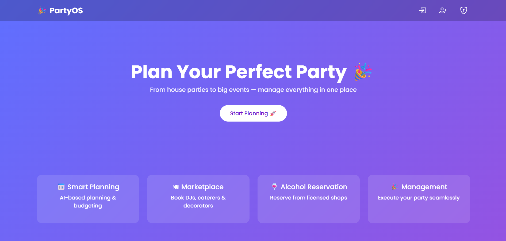</td>
    <td><b>User Login Page</b><br/>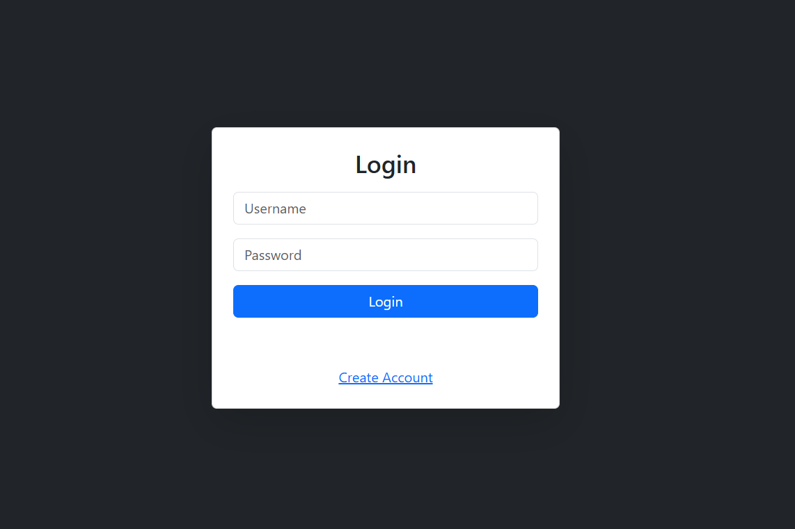</td>
  </tr>
  <tr>
    <td><b>Role Based User Registration Page</b><br/>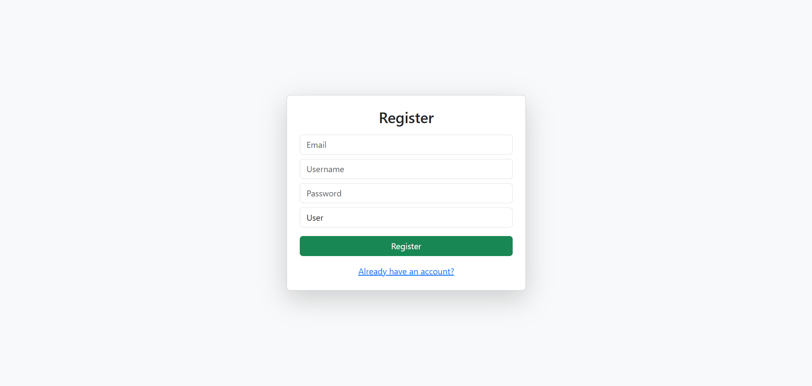</td>
    <td><b>Market Place</b><br/>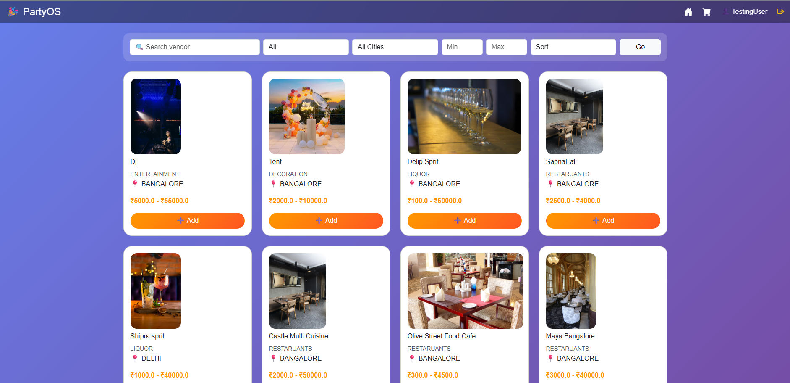</td>
  </tr>
  <tr>
    <td><b>Alcohol Reservation Page</b><br/>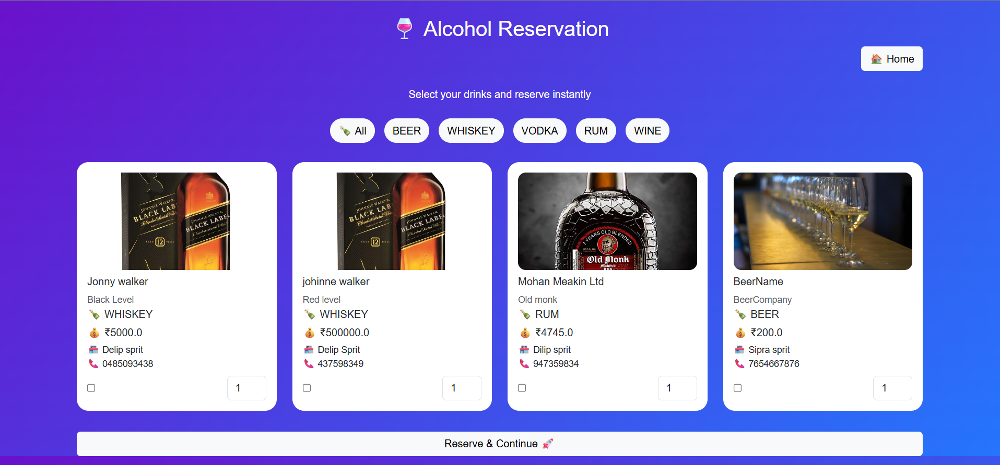</td>
    <td><b>User Cart</b><br/>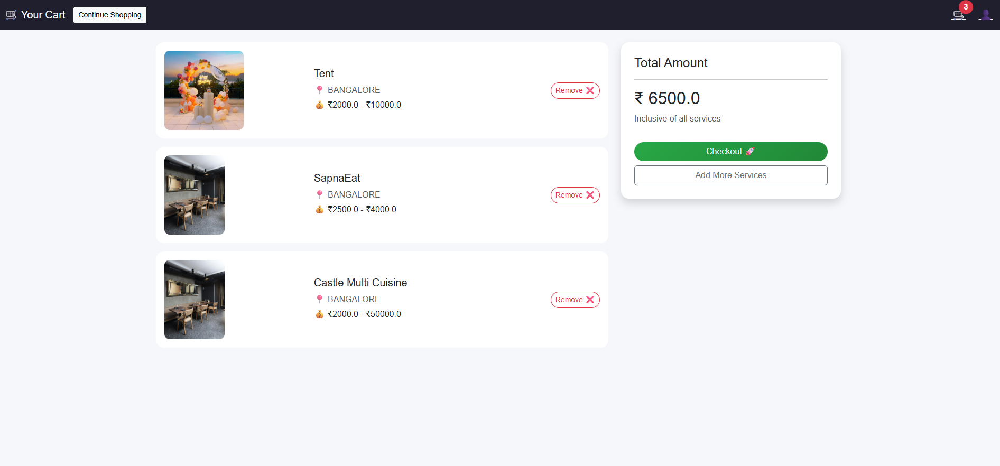</td>
  </tr>
  <tr>
    <td><b>User Profile</b><br/>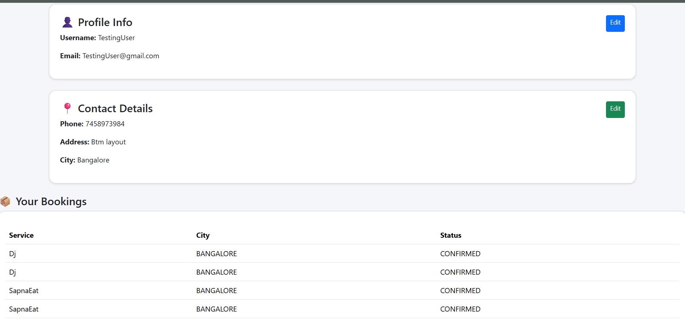</td>
    <td><b>Smart Plaing</b><br/>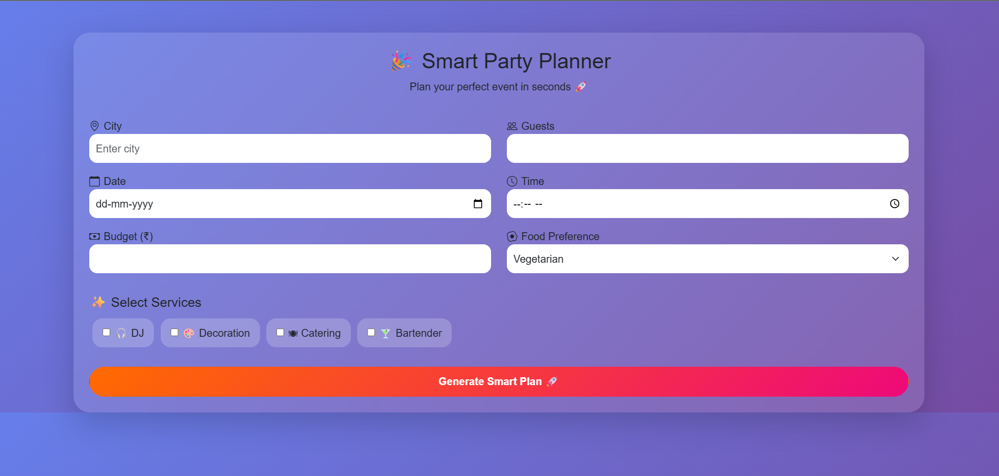</td>
  </tr>
  <tr>
    <td><b>Smar Planning With Data</b><br/>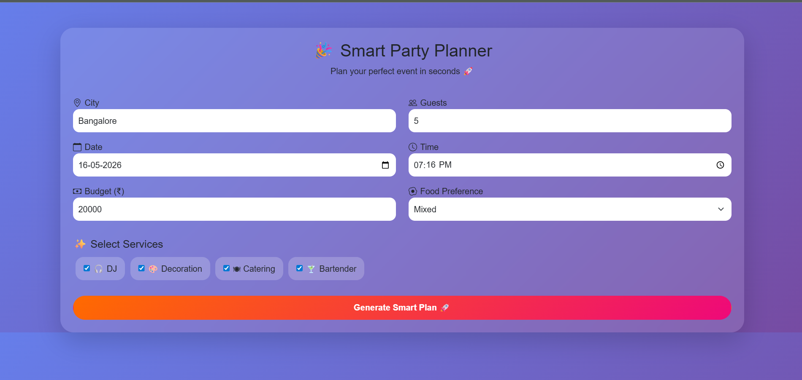</td>
    <td><b>Smart Planning Estimated Result</b><br/>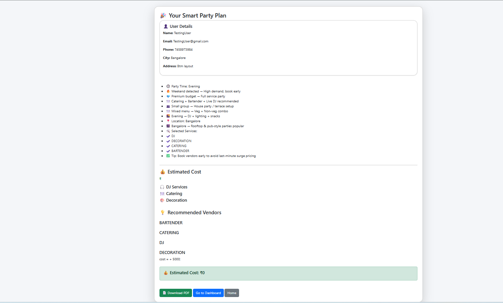</td>
  </tr>
  <tr>
    <td><b>Admin Dashboard</b><br/>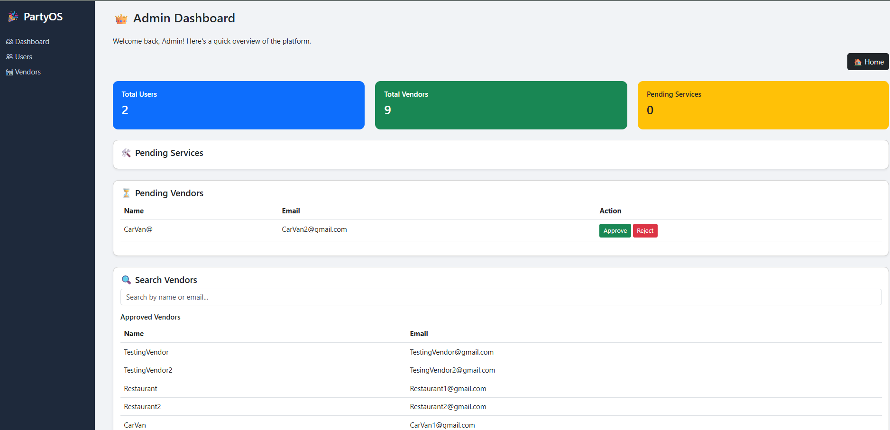</td>
    <td><b>Vendor Dashboard</b><br/>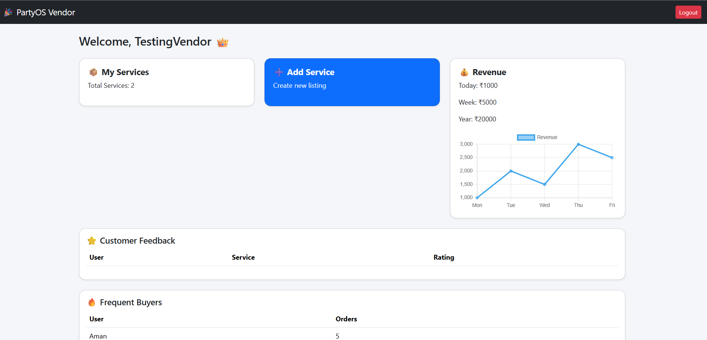</td>
  </tr>
  <tr>
    <td><b>Vendor Service Addition</b><br/>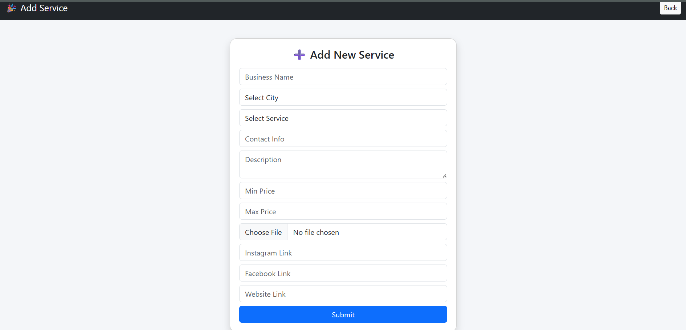</td>
    <td><b>Vendor Services</b><br/>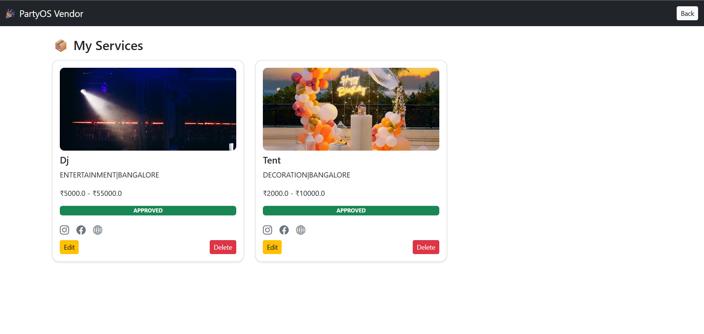</td>
  </tr>
</table>

## Roadmap

- Payment gateway integration
- Real-time notifications
- Mobile-first client experience
- Advanced analytics and reporting

## Contributing

Contributions are welcome. Open an issue first for major changes, then submit a PR with a clear summary and testing notes.

## License

No license file is currently defined. Add a `LICENSE` file to define usage terms.
